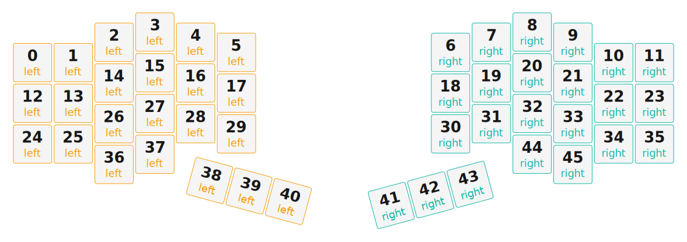

# ZMK Configuration for cloudy_day

*Generated by Shield Wizard for ZMK*



Download compiled firmware from the Actions tab. <https://zmk.dev/docs/user-setup#installing-the-firmware>

Edit your keymap <https://zmk.dev/docs/keymaps>.
User keymap is located at [`config/cloudy_day.keymap`](config/cloudy_day.keymap).

-----

<details>
<summary>
Shield Wizard Debug Information
</summary>

In case of broken configuration, here is the Shield Wizard internal data used to generate this configuration:

Commit: 8a52249f61161469b6d90ed8c80c4aa52b9f3858

```json
{"name":"cloudy_day","shield":"cloudy_day","dongle":false,"modules":["badjeff/pmw3610"],"layout":[{"id":"01KGKNQTFF5DRDQC5P9EBJBNR8","part":0,"row":0,"col":0,"w":1,"h":1,"x":0,"y":0.75,"r":0,"rx":0,"ry":0},{"id":"01KGKNQZ4AD4V4DX3932JGCRMK","part":0,"row":0,"col":1,"w":1,"h":1,"x":1,"y":0.75,"r":0,"rx":0,"ry":0},{"id":"01KGKNR06YMH40WHDE6322D12F","part":0,"row":0,"col":2,"w":1,"h":1,"x":2,"y":0.25,"r":0,"rx":0,"ry":0},{"id":"01KGKNR0P1D44JGMRBS2N02HBW","part":0,"row":0,"col":3,"w":1,"h":1,"x":3,"y":0,"r":0,"rx":0,"ry":0},{"id":"01KGKNR0WHN0X63JNY8C5CCP1J","part":0,"row":0,"col":4,"w":1,"h":1,"x":4,"y":0.25,"r":0,"rx":0,"ry":0},{"id":"01KGKNR13VJTQGRHHYA8MQEENH","part":0,"row":0,"col":5,"w":1,"h":1,"x":5,"y":0.5,"r":0,"rx":0,"ry":0},{"id":"01KGKNR4XER6SNSKGCEVWVYE8A","part":1,"row":0,"col":8,"w":1,"h":1,"x":10.25,"y":0.5,"r":0,"rx":0,"ry":0},{"id":"01KGKNR5B7X8YK8G89QQ91R62Q","part":1,"row":0,"col":9,"w":1,"h":1,"x":11.25,"y":0.25,"r":0,"rx":0,"ry":0},{"id":"01KGKNR5NDWVWEV96ZVF1WKV5N","part":1,"row":0,"col":10,"w":1,"h":1,"x":12.25,"y":0,"r":0,"rx":0,"ry":0},{"id":"01KGKNR95MY8Q6FNEBS101TTV6","part":1,"row":0,"col":11,"w":1,"h":1,"x":13.25,"y":0.25,"r":0,"rx":0,"ry":0},{"id":"01KGKNR9MRJAB7MJ1W5SXJMNQG","part":1,"row":0,"col":12,"w":1,"h":1,"x":14.25,"y":0.75,"r":0,"rx":0,"ry":0},{"id":"01KGKNRAAWB5FCRRSMTZTSNGTF","part":1,"row":0,"col":13,"w":1,"h":1,"x":15.25,"y":0.75,"r":0,"rx":0,"ry":0},{"id":"01KGKNRBZFBX7GTV9ZVB7840MR","part":0,"row":1,"col":0,"w":1,"h":1,"x":0,"y":1.75,"r":0,"rx":0,"ry":0},{"id":"01KGKNSZZH82872CS8EPGEAPJD","part":0,"row":1,"col":1,"w":1,"h":1,"x":1,"y":1.75,"r":0,"rx":0,"ry":0},{"id":"01KGKNTMC1V11RRMP8G94CANVX","part":0,"row":1,"col":2,"w":1,"h":1,"x":2,"y":1.25,"r":0,"rx":0,"ry":0},{"id":"01KGKNTPDS1NK3D3JB0GX1PBY6","part":0,"row":1,"col":3,"w":1,"h":1,"x":3,"y":1,"r":0,"rx":0,"ry":0},{"id":"01KGKNTQVHMXQAJDWHG1PF3BD0","part":0,"row":1,"col":4,"w":1,"h":1,"x":4,"y":1.25,"r":0,"rx":0,"ry":0},{"id":"01KGKNTR0YYFGK0H4NSARCA4YM","part":0,"row":1,"col":5,"w":1,"h":1,"x":5,"y":1.5,"r":0,"rx":0,"ry":0},{"id":"01KGKNTRGV723TZK2G6C48G61D","part":1,"row":1,"col":8,"w":1,"h":1,"x":10.25,"y":1.5,"r":0,"rx":0,"ry":0},{"id":"01KGKNTW1J2J3A3W5B4BWZBT7Y","part":1,"row":1,"col":9,"w":1,"h":1,"x":11.25,"y":1.25,"r":0,"rx":0,"ry":0},{"id":"01KGKNTW69VJC3K69617DZP62Y","part":1,"row":1,"col":10,"w":1,"h":1,"x":12.25,"y":1,"r":0,"rx":0,"ry":0},{"id":"01KGKNTWB7G87X2WDDMZDQ4KDB","part":1,"row":1,"col":11,"w":1,"h":1,"x":13.25,"y":1.25,"r":0,"rx":0,"ry":0},{"id":"01KGKNTWGHGSM2E4V64VCPK5W6","part":1,"row":1,"col":12,"w":1,"h":1,"x":14.25,"y":1.75,"r":0,"rx":0,"ry":0},{"id":"01KGKNTWMJPWF331K7H5C6VKFA","part":1,"row":1,"col":13,"w":1,"h":1,"x":15.25,"y":1.75,"r":0,"rx":0,"ry":0},{"id":"01KGKNVEG2K8TYSQPF9BQWC4K8","part":0,"row":2,"col":0,"w":1,"h":1,"x":0,"y":2.75,"r":0,"rx":0,"ry":0},{"id":"01KGKPNGH0AQC1507F5ND4YB4Q","part":0,"row":2,"col":1,"w":1,"h":1,"x":1,"y":2.75,"r":0,"rx":0,"ry":0},{"id":"01KGKPNJF3ZWH42DCTF7D7259Y","part":0,"row":2,"col":2,"w":1,"h":1,"x":2,"y":2.25,"r":0,"rx":0,"ry":0},{"id":"01KGKPNJMJY3C0TCZ3H7XX4RMW","part":0,"row":2,"col":3,"w":1,"h":1,"x":3,"y":2,"r":0,"rx":0,"ry":0},{"id":"01KGKPNJT5PB12SCSG912R8TTP","part":0,"row":2,"col":4,"w":1,"h":1,"x":4,"y":2.25,"r":0,"rx":0,"ry":0},{"id":"01KGKPNK09ZK2YB8WXATBG39BX","part":0,"row":2,"col":5,"w":1,"h":1,"x":5,"y":2.5,"r":0,"rx":0,"ry":0},{"id":"01KGKPNKJBBA97YSHFM47R6NFX","part":1,"row":2,"col":8,"w":1,"h":1,"x":10.25,"y":2.5,"r":0,"rx":0,"ry":0},{"id":"01KGKPNKQVEAN6ET7HF90KMYGH","part":1,"row":2,"col":9,"w":1,"h":1,"x":11.25,"y":2.25,"r":0,"rx":0,"ry":0},{"id":"01KGKPNKZ5EKA2SMJ4TK6V12EA","part":1,"row":2,"col":10,"w":1,"h":1,"x":12.25,"y":2,"r":0,"rx":0,"ry":0},{"id":"01KGKPNM5R0T5T6Y7GQBKP9D1S","part":1,"row":2,"col":11,"w":1,"h":1,"x":13.25,"y":2.25,"r":0,"rx":0,"ry":0},{"id":"01KGKPNMC06WZH6JEMQK01MPWZ","part":1,"row":2,"col":12,"w":1,"h":1,"x":14.25,"y":2.75,"r":0,"rx":0,"ry":0},{"id":"01KGKPNN21YJ8419XZE21P02XD","part":1,"row":2,"col":13,"w":1,"h":1,"x":15.25,"y":2.75,"r":0,"rx":0,"ry":0},{"id":"01KGKPSKS0XPZ82VH8SYCVC02M","part":0,"row":3,"col":2,"w":1,"h":1,"x":2,"y":3.25,"r":0,"rx":0,"ry":0},{"id":"01KGKQ3SJ9A801H23VJ2X0V0Q1","part":0,"row":3,"col":3,"w":1,"h":1,"x":3,"y":3,"r":0,"rx":0,"ry":0},{"id":"01KGKQ3V1N40AV8Y3H2BWM00AF","part":0,"row":3,"col":4,"w":1,"h":1,"x":5.25,"y":2.25,"r":15,"rx":0,"ry":0},{"id":"01KGKQ3YECA088519WYRA5KGND","part":0,"row":3,"col":5,"w":1,"h":1,"x":6.25,"y":2.25,"r":15,"rx":0,"ry":0},{"id":"01KGKQ3YS1ZS072VYBV8A71PMK","part":0,"row":3,"col":6,"w":1,"h":1,"x":7.25,"y":2.25,"r":15,"rx":0,"ry":0},{"id":"01KGKQ3ZFVPWPKG5FNWCCKDDQS","part":1,"row":3,"col":7,"w":1,"h":1,"x":7.25,"y":6.5,"r":-15,"rx":0,"ry":0},{"id":"01KGKQ3ZW3WMHRSTZ5BPANKEEF","part":1,"row":3,"col":8,"w":1,"h":1,"x":8.25,"y":6.5,"r":-15,"rx":0,"ry":0},{"id":"01KGKQ4074P8QSRYHMHJW990Q1","part":1,"row":3,"col":9,"w":1,"h":1,"x":9.25,"y":6.5,"r":-15,"rx":0,"ry":0},{"id":"01KGKQ40QHXG8PMDQ9520GE67D","part":1,"row":3,"col":10,"w":1,"h":1,"x":12.25,"y":3,"r":0,"rx":0,"ry":0},{"id":"01KGKQ412BPN89F275C0ZTJN83","part":1,"row":3,"col":11,"w":1,"h":1,"x":13.25,"y":3.25,"r":0,"rx":0,"ry":0}],"parts":[{"name":"left","controller":"nice_nano_v2","wiring":"matrix_diode","pins":{"d16":"input","d8":"input","d9":"input","d14":"output","d15":"output","d18":"output","d19":"output","d20":"output","d21":"output","d7":"output","d3":"bus","d4":"bus","d5":"bus","d2":"bus","d10":"input"},"keys":{"01KGKNQTFF5DRDQC5P9EBJBNR8":{"input":"d10","output":"d14"},"01KGKNRBZFBX7GTV9ZVB7840MR":{"input":"d16","output":"d14"},"01KGKNVEG2K8TYSQPF9BQWC4K8":{"input":"d9","output":"d14"},"01KGKNQZ4AD4V4DX3932JGCRMK":{"input":"d10","output":"d20"},"01KGKNSZZH82872CS8EPGEAPJD":{"input":"d16","output":"d20"},"01KGKPNGH0AQC1507F5ND4YB4Q":{"input":"d9","output":"d20"},"01KGKNR06YMH40WHDE6322D12F":{"input":"d10","output":"d18"},"01KGKNTMC1V11RRMP8G94CANVX":{"input":"d16","output":"d18"},"01KGKPNJF3ZWH42DCTF7D7259Y":{"input":"d9","output":"d18"},"01KGKPSKS0XPZ82VH8SYCVC02M":{"input":"d8","output":"d18"},"01KGKNR0P1D44JGMRBS2N02HBW":{"input":"d10","output":"d19"},"01KGKNTPDS1NK3D3JB0GX1PBY6":{"input":"d16","output":"d19"},"01KGKPNJMJY3C0TCZ3H7XX4RMW":{"input":"d9","output":"d19"},"01KGKQ3SJ9A801H23VJ2X0V0Q1":{"input":"d8","output":"d19"},"01KGKNR0WHN0X63JNY8C5CCP1J":{"input":"d10","output":"d15"},"01KGKNTQVHMXQAJDWHG1PF3BD0":{"input":"d16","output":"d15"},"01KGKPNJT5PB12SCSG912R8TTP":{"input":"d9","output":"d15"},"01KGKQ3V1N40AV8Y3H2BWM00AF":{"input":"d8","output":"d15"},"01KGKNR13VJTQGRHHYA8MQEENH":{"input":"d10","output":"d21"},"01KGKNTR0YYFGK0H4NSARCA4YM":{"input":"d16","output":"d21"},"01KGKPNK09ZK2YB8WXATBG39BX":{"input":"d9","output":"d21"},"01KGKQ3YECA088519WYRA5KGND":{"input":"d8","output":"d21"},"01KGKQ3YS1ZS072VYBV8A71PMK":{"input":"d8","output":"d7"}},"encoders":[],"buses":[{"name":"spi0","devices":[{"type":"pmw3610","cs":"d4","irq":"d5","cpi":600,"swapxy":false,"invertx":false,"inverty":false}],"type":"spi","mosi":"d2","miso":"d2","sck":"d3"},{"name":"spi1","devices":[],"type":"spi"},{"name":"spi2","devices":[],"type":"spi"},{"name":"spi3","devices":[],"type":"spi"},{"name":"i2c0","devices":[],"type":"i2c"},{"name":"i2c1","devices":[],"type":"i2c"}]},{"name":"right","controller":"nice_nano_v2","wiring":"matrix_diode","pins":{"d9":"input","d8":"input","d16":"input","d10":"input","d14":"output","d15":"output","d18":"output","d19":"output","d20":"output","d21":"output","d7":"output"},"keys":{"01KGKNR4XER6SNSKGCEVWVYE8A":{"input":"d8","output":"d14"},"01KGKNR5B7X8YK8G89QQ91R62Q":{"input":"d8","output":"d15"},"01KGKNR5NDWVWEV96ZVF1WKV5N":{"input":"d8","output":"d18"},"01KGKNR95MY8Q6FNEBS101TTV6":{"input":"d8","output":"d19"},"01KGKNR9MRJAB7MJ1W5SXJMNQG":{"input":"d8","output":"d20"},"01KGKNRAAWB5FCRRSMTZTSNGTF":{"input":"d8","output":"d21"},"01KGKNTRGV723TZK2G6C48G61D":{"input":"d9","output":"d14"},"01KGKNTW1J2J3A3W5B4BWZBT7Y":{"input":"d9","output":"d15"},"01KGKNTW69VJC3K69617DZP62Y":{"input":"d9","output":"d18"},"01KGKNTWB7G87X2WDDMZDQ4KDB":{"input":"d9","output":"d19"},"01KGKNTWGHGSM2E4V64VCPK5W6":{"input":"d9","output":"d20"},"01KGKNTWMJPWF331K7H5C6VKFA":{"input":"d9","output":"d21"},"01KGKPNKJBBA97YSHFM47R6NFX":{"input":"d10","output":"d14"},"01KGKPNKQVEAN6ET7HF90KMYGH":{"input":"d10","output":"d15"},"01KGKPNKZ5EKA2SMJ4TK6V12EA":{"input":"d10","output":"d18"},"01KGKPNM5R0T5T6Y7GQBKP9D1S":{"input":"d10","output":"d19"},"01KGKPNMC06WZH6JEMQK01MPWZ":{"input":"d10","output":"d20"},"01KGKPNN21YJ8419XZE21P02XD":{"input":"d10","output":"d21"},"01KGKQ3ZFVPWPKG5FNWCCKDDQS":{"input":"d16","output":"d7"},"01KGKQ3ZW3WMHRSTZ5BPANKEEF":{"input":"d16","output":"d14"},"01KGKQ4074P8QSRYHMHJW990Q1":{"input":"d16","output":"d15"},"01KGKQ40QHXG8PMDQ9520GE67D":{"input":"d16","output":"d18"},"01KGKQ412BPN89F275C0ZTJN83":{"input":"d16","output":"d19"}},"encoders":[],"buses":[{"name":"spi0","devices":[],"type":"spi"},{"name":"spi1","devices":[],"type":"spi"},{"name":"spi2","devices":[],"type":"spi"},{"name":"spi3","devices":[],"type":"spi"},{"name":"i2c0","devices":[],"type":"i2c"},{"name":"i2c1","devices":[],"type":"i2c"}]}]}
```

</details>
